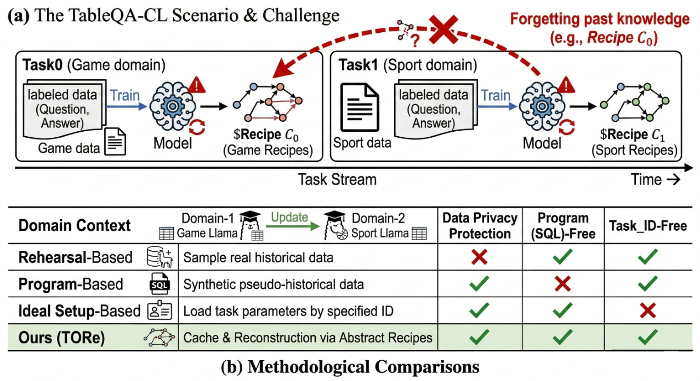
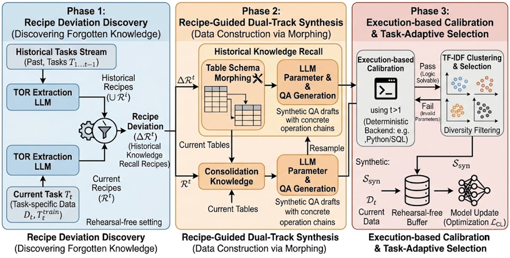

# TORe: Rehearsal-Free Continual Learning for Table QA via Operation Recipe Reconstruction

<p align="center">
  <!-- TODO: 替换下方占位链接。XXXX.XXXXX → arXiv 论文 ID；your-github/TORe → 你的 GitHub 仓库地址 -->
  <a href="https://arxiv.org/abs/XXXX.XXXXX"></a>
  <a href="https://arxiv.org/abs/XXXX.XXXXX"></a>
  <a href="https://github.com/oaker/TORe"></a>
</p>

<p align="center">
  
</p>

<p align="center"><i>(a) The TableQA-CL scenario. (b) Methodological comparisons: TORe combines rehearsal-free operation with schema-agnostic knowledge reconstruction — avoiding raw-data replay and requiring neither SQL programs nor task-ID labels.</i></p>

## 📝 Summary

**TORe** (Table Operation Recipe Reconstruction) is a *rehearsal-free* continual learning framework for Table Question Answering over task streams (**TableQA-CL**). Instead of replaying raw historical data, TORe reconstructs past knowledge through schema-aware reasoning patterns:

- It extracts abstract **Operation Recipes** from the table reasoning process.
- It identifies fine-grained knowledge deviations (ΔR) between the current and historical recipes.
- It uses **execution-verified LLM synthesis** to generate pseudo-examples that reflect both current and historical reasoning patterns — reinforcing consolidation knowledge and filling knowledge gaps.

Experiments on two TableQA-CL benchmarks (*Mixed-QA-Stream*, *Mixed-Struct-Stream*) across multiple backbones show that TORe consistently improves average accuracy over strong rehearsal-free baselines, remains competitive with replay-based methods, and is robust to different task orderings.

<p align="center">
  
</p>

<p align="center"><i>Knowledge reconstruction on task <i>t</i>. Operations are sequentially selected from the Operation Pool and stripped of parameters to form the Table Operation Recipe R<sup>t</sup>. The difference to historical recipes (ΔR<sup>t</sup>) — both consisting only of predefined abstract operations, no historical data — guides the construction of Consolidation and Historical Knowledge.</i></p>

## 📁 Repository

Each folder ships its own `README.md` with full instructions — no need to duplicate them here.

| Directory | What's inside | Details |
|-----------|---------------|---------|
| [`KORe/`](KORe/README.md) | The TORe framework: Operation-Recipe reconstruction, vLLM-based inference, the predefined Operation Pool, and data-construction pipelines | [`README`](KORe/README.md) |
| [`Baselines/`](Baselines/) | Compared methods: MTL, vanilla, KmeansSel, RandomSel, naive_generate | — |
| [`evaluate/`](evaluate/) | Inference (`inference.py`) and evaluation metrics (`evaluate.py`) used in the paper | — |

> ℹ️ The implementation directory is named `KORe` (the framework's working name); it is the **TORe** method described in the paper.

## 📊 Datasets

TORe is built on four public datasets. Download them and point the `path_to_data` config in `KORe/` to your local copies.

| Dataset | Source |
|---------|--------|
| Squall | <https://opendatalab.com/OpenDataLab/squall> |
| TableInstruct | <https://huggingface.co/datasets/Multilingual-Multimodal-NLP/TableInstruct> |
| MMQA | <https://anonymous.4open.science/r/MMQA-34B1> |
| OmniSQL | <https://github.com/RUCKBReasoning/OmniSQL> |

## 📚 Citation

If you find this work useful, please cite:

```bibtex
@inproceedings{zhang2026tore,
  title     = {TORe: Rehearsal-Free Continual Learning for Table QA via Operation Recipe Reconstruction},
  author    = {Zhang, Jinyu and Liu, Ruiheng and Zhang, Yu},
  booktitle = {Proceedings of the ...},   % TODO: 填入会议名 (e.g. EMNLP)
  year      = {2026}
}
```

## 🙏 Acknowledgements

Thanks to the authors of [Squall](https://opendatalab.com/OpenDataLab/squall), [TableInstruct](https://huggingface.co/datasets/Multilingual-Multimodal-NLP/TableInstruct), [MMQA](https://anonymous.4open.science/r/MMQA-34B1), and [OmniSQL](https://github.com/RUCKBReasoning/OmniSQL) for releasing the datasets used in this work.
